# Practicals: Causal Inference

## Load packages

``` r

library(APTSCausalInference)
# required for data management and plots
library(data.table)
library(dplyr)
library(ggplot2)

# required for analysis
library(AIPW)
library(cobalt)
library(ipw)
library(sandwich)
library(stdReg)
library(SuperLearner)
library(survey)
```

## Load the Rotterdam Breast Cancer data set

``` r

# data(bcrot)
load("../data/bcrot.RData")
```

## Descriptive Analysis

Compare descriptively QOL for those who do and do not take hormonal
therapy

``` r

# qol ~ hormon
plot.qol <- ggplot(bcrot, aes(x=qol, after_stat(density), fill=factor(hormon))) +
    geom_histogram(aes(fill=as.factor(hormon)), color=c("#e9ecef"), binwidth = 2) +
    facet_grid(as.factor(hormon) ~ .) +
    labs(x = "Quality of life", y = "Density") +
    scale_fill_manual(values=c("#69b3a2", "#337CA0"),
                      name="Hormonal\ntreatment",
                      breaks=c("0", "1"),
                      labels=c("no", "yes")) +
    theme_light()
plot.qol
```

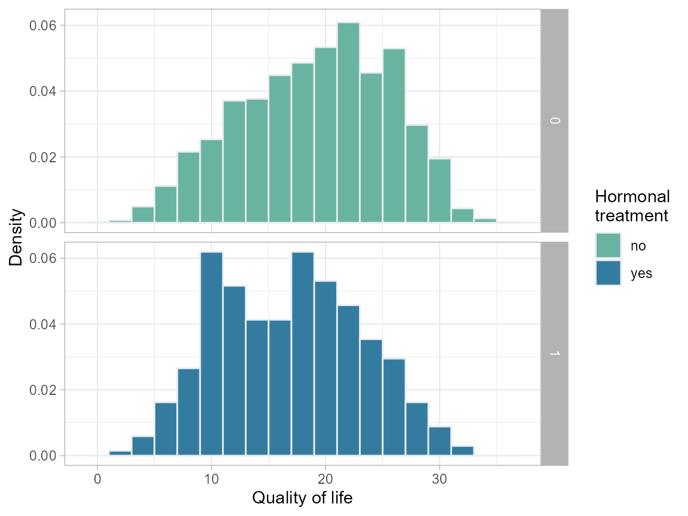

``` r


# age ~ hormon
plot.age <- ggplot(bcrot, aes(x=age, after_stat(density), fill=as.factor(hormon))) +
    geom_histogram(aes(fill=as.factor(hormon)), color=c("#e9ecef"), binwidth = 2) +
    facet_grid(as.factor(hormon) ~ .) +
    labs(x = "Age", y = "Density") +
    scale_fill_manual(values=c("#69b3a2", "#337CA0"),
                      name="Hormonal\ntreatment",
                      breaks=c("0", "1"),
                      labels=c("no", "yes")) +
    theme_light()
plot.age
```

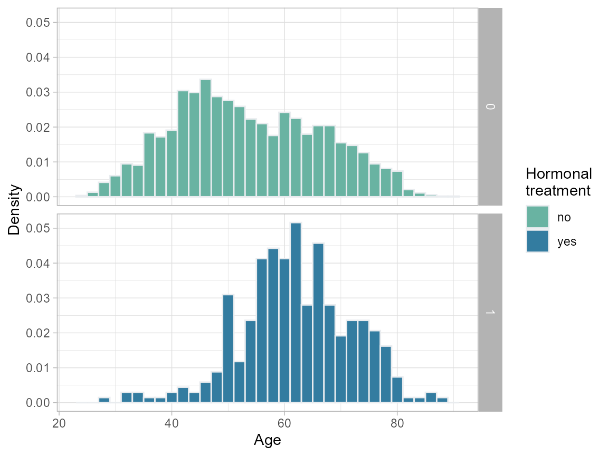

``` r


# Lymph nodes ~ hormon
plot.nodes <- ggplot(bcrot, aes(x=nodes, after_stat(density), fill=as.factor(hormon))) +
    geom_histogram(aes(fill=as.factor(hormon)), color=c("#e9ecef"), binwidth = 1) +
    facet_grid(as.factor(hormon) ~ .) +
    labs(x = "Number of positive lymph nodes", y = "Density") +
    scale_fill_manual(values=c("#69b3a2", "#337CA0"),
                      name="Hormonal\ntreatment",
                      breaks=c("0", "1"),
                      labels=c("no", "yes")) +
    theme_light()
plot.nodes
```


``` r


ggplot(bcrot, aes(x=enodes, after_stat(density), fill=as.factor(hormon))) +
  geom_histogram(aes(fill=as.factor(hormon)), color=c("#e9ecef"), binwidth = 0.1) +
  facet_grid(as.factor(hormon) ~ .) +
  labs(x = "Number of positive lymph nodes (transformed: exp(-0.12 * nodes))",
       y = "Density") +
  scale_fill_manual(values=c("#69b3a2", "#337CA0"),
                    name="Hormonal\ntreatment",
                    breaks=c("0", "1"),
                    labels=c("no", "yes")) +
  theme_light()
```

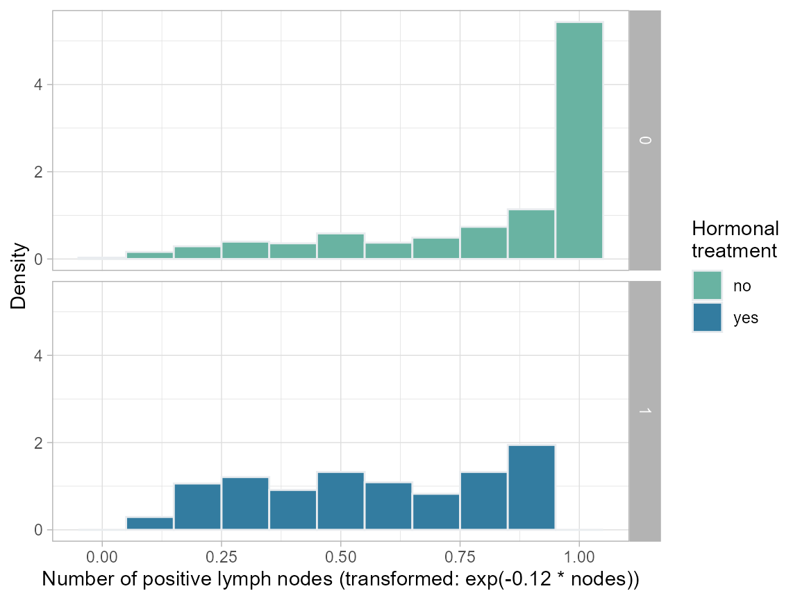

``` r


# PgR (fmol/l), log ~ hormon
ggplot(bcrot, aes(x=pr_1, after_stat(density), fill=as.factor(hormon))) +
  geom_histogram(aes(fill=as.factor(hormon)), color=c("#e9ecef"), binwidth = 0.5) +
  facet_grid(as.factor(hormon) ~ .) +
  labs(x = "PgR [fmol/l] (transformed: log(pr)", y = "Density") +
  scale_fill_manual(values=c("#69b3a2", "#337CA0"),
                    name="Hormonal\ntreatment",
                    breaks=c("0", "1"),
                    labels=c("no", "yes")) +
  theme_light()
```

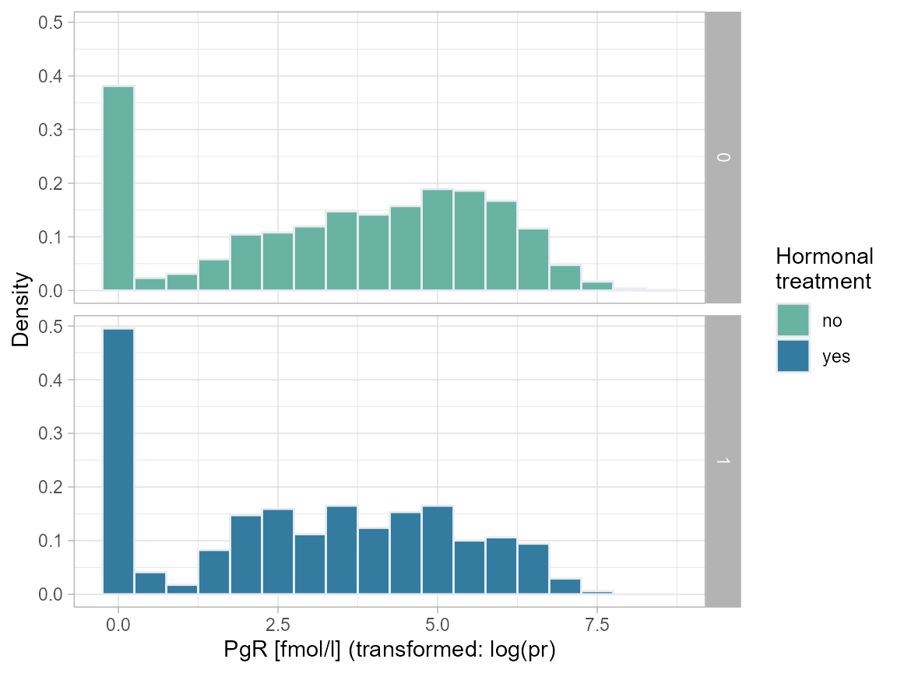

## Analysis

### Linear Model

We compare an unadjusted naive linear model (2-groups) with a naive
adjusted main-effects-only model (this is too simplistic to be
plausible; and it is not robust). We can see that the unadjusted
analysis is (likely) very biased - the effect reverses upon adjustment.
Note that the analysis does not alert us to any positivity issues as it
simply extrapolates.

``` r

# Unadjusted linear regression
lm.ua <- lm(qol ~ hormon, data = bcrot)
summary(lm.ua)
## 
## Call:
## lm(formula = qol ~ hormon, data = bcrot)
## 
## Residuals:
##      Min       1Q   Median       3Q      Max 
## -19.1327  -4.8698   0.5183   5.0403  16.2516 
## 
## Coefficients:
##             Estimate Std. Error t value Pr(>|t|)    
## (Intercept)  19.1327     0.1265 151.276  < 2e-16 ***
## hormon1      -2.2928     0.3751  -6.112 1.11e-09 ***
## ---
## Signif. codes:  0 '***' 0.001 '**' 0.01 '*' 0.05 '.' 0.1 ' ' 1
## 
## Residual standard error: 6.502 on 2980 degrees of freedom
## Multiple R-squared:  0.01238,    Adjusted R-squared:  0.01205 
## F-statistic: 37.36 on 1 and 2980 DF,  p-value: 1.109e-09
```

``` r

# Main-effects linear regression
lm.a <- lm(qol ~ hormon + age + enodes + pr_1, data = bcrot)
summary(lm.a)
## 
## Call:
## lm(formula = qol ~ hormon + age + enodes + pr_1, data = bcrot)
## 
## Residuals:
##     Min      1Q  Median      3Q     Max 
## -3.6246 -0.6854 -0.0094  0.6695  3.5638 
## 
## Coefficients:
##              Estimate Std. Error t value Pr(>|t|)    
## (Intercept) 22.517992   0.106599  211.24   <2e-16 ***
## hormon1      1.806415   0.062397   28.95   <2e-16 ***
## age         -0.253940   0.001461 -173.79   <2e-16 ***
## enodes       1.985456   0.073795   26.91   <2e-16 ***
## pr_1         2.495491   0.008312  300.22   <2e-16 ***
## ---
## Signif. codes:  0 '***' 0.001 '**' 0.01 '*' 0.05 '.' 0.1 ' ' 1
## 
## Residual standard error: 1.01 on 2977 degrees of freedom
## Multiple R-squared:  0.9762, Adjusted R-squared:  0.9762 
## F-statistic: 3.054e+04 on 4 and 2977 DF,  p-value: < 2.2e-16
```

### Propensity score (PS)

We saw that positivity is an issue with nodes=0 and younger ages. Here
we look at how to detect this from the propensity score (PS). We begin
with a simple main-effects-only PS model.

``` r

ps <- glm(hormon ~ age + enodes + pr_1,
          data = bcrot,
          family = binomial(link="logit"))

# add fitted values to data set
bcrot$ps <- fitted(ps)

# plot density
ggplot(bcrot, aes(ps, fill = as.factor(hormon))) +
  geom_density(alpha = 0.5) +
  labs(x = "Propensity score",
       y = "Density",
       fill = "Hormone\ntreatment") +
  scale_fill_manual(values=c("#69b3a2", "#337CA0"),
                    name="Hormonal\ntreatment",
                    breaks=c("0", "1"),
                    labels=c("no", "yes")) +
  theme_light()
```

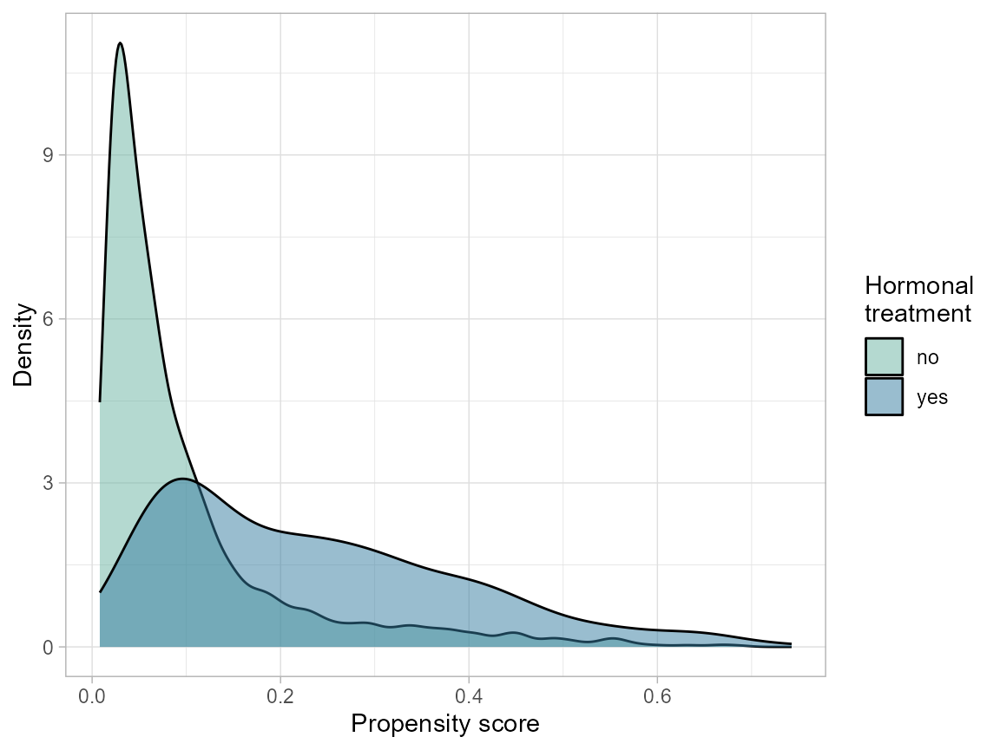

``` r


# Histogram
ggplot(data = bcrot, aes(x = ps, after_stat(density), fill = as.factor(hormon))) +
  #geom_histogram(alpha = 0.5, position = "identity", binwidth = 0.05) +
  geom_histogram(aes(fill=as.factor(hormon)), color=c("#e9ecef"), binwidth = 0.05) +
  facet_grid(hormon ~ .) +
  labs(x = "Propensity score", y = "Density") +
  scale_fill_manual(values=c("#69b3a2", "#337CA0"),
                    name="Hormonal\ntreatment",
                    breaks=c("0", "1"),
                    labels=c("no", "yes")) +
  theme_light()
```

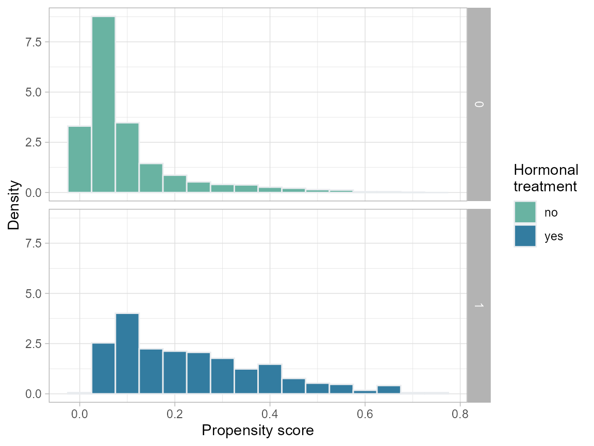

### Inverse Probability Treatment Weighting

We also find that we have some extreme weights (though, I have seen
worse). The weighted data does not achieve balance in age and enodes;
this could be due to lack of positivity and/or because the PS model is
bad.

``` r

bcrot$w <- (as.numeric(as.character(bcrot$hormon)) / bcrot$ps) +
           ((1 - as.numeric(as.character(bcrot$hormon))) / (1 - bcrot$ps))
summary(bcrot$w)
##    Min. 1st Qu.  Median    Mean 3rd Qu.    Max. 
##   1.008   1.035   1.073   1.854   1.206  63.482

# Plot inverse probability weights vs. index
ggplot(bcrot, aes(x = 1:nrow(bcrot), y = w)) +
  geom_point()  +
  xlab(" ") +
  ylab(" ") +
  ylim(0, 65) +
  theme_minimal()
```

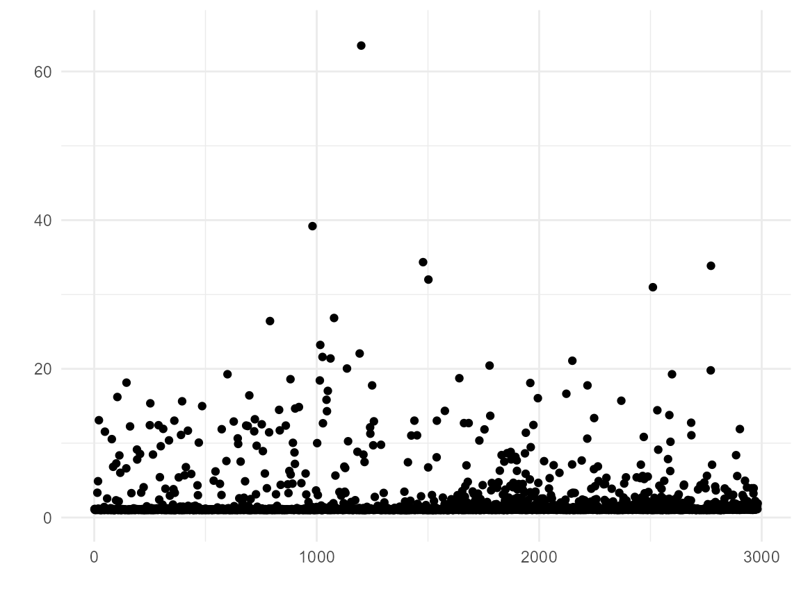

``` r


# Covariate balance plot (love plot - named after Thomas E. Love)
cobalt::love.plot(hormon ~ age + enodes + pr_1,
                  data = bcrot,
                  weights = bcrot$w,
                  s.d.denom = "pooled",
                  thresholds = c(m = .1))
```

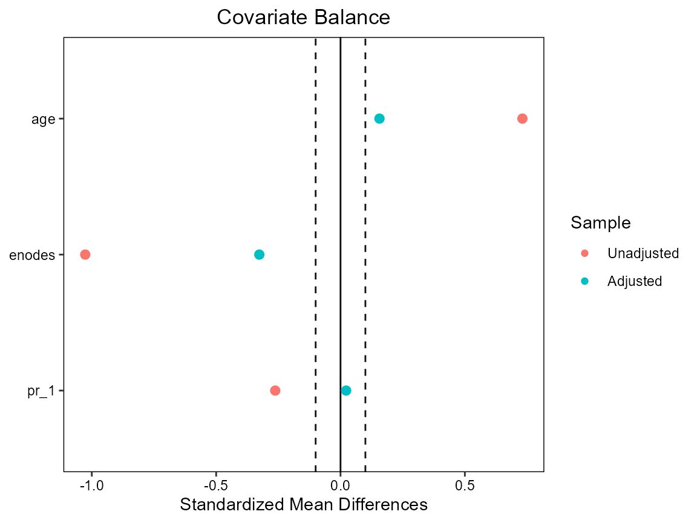

### Use subset

We decide that the effect is ill-defined for nodes=0 and age\<40; thus
we create a more meaningful subset of the population for which to
compare treatment with no-treatment. Note that we lose more than half
(ca. 1500) of the untreated, but only 7 of the treated patients.

``` r

plot.age
```


``` r

plot.nodes
```

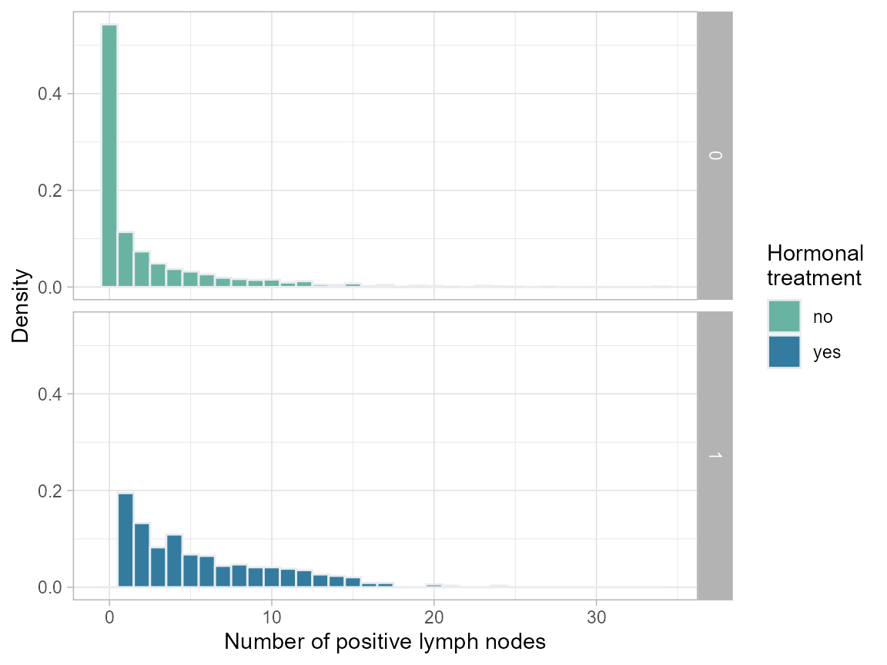

``` r


# restrict dataset and transformation
bcrot2 <- bcrot %>% filter(age >= 40,
                           nodes > 0) %>%
                    mutate(age.2 = age * age) %>%    # add age²
                    select(-c(ps, w))

table(bcrot2$hormon)
## 
##    0    1 
## 1045  332
table(bcrot$hormon)
## 
##    0    1 
## 2643  339


# Main-effects and adjustes linear regression models using the subset
lm.ua2 <- lm(qol ~ hormon, data = bcrot2)
summary(lm.ua2)
## 
## Call:
## lm(formula = qol ~ hormon, data = bcrot2)
## 
## Residuals:
##      Min       1Q   Median       3Q      Max 
## -18.1346  -5.1450   0.4281   4.8286  16.7480 
## 
## Coefficients:
##             Estimate Std. Error t value Pr(>|t|)    
## (Intercept)  18.1346     0.1977  91.744  < 2e-16 ***
## hormon1      -1.4797     0.4026  -3.676 0.000246 ***
## ---
## Signif. codes:  0 '***' 0.001 '**' 0.01 '*' 0.05 '.' 0.1 ' ' 1
## 
## Residual standard error: 6.39 on 1375 degrees of freedom
## Multiple R-squared:  0.00973,    Adjusted R-squared:  0.00901 
## F-statistic: 13.51 on 1 and 1375 DF,  p-value: 0.0002464
lm.a2 <- lm(qol ~ hormon + age + enodes + pr_1, data = bcrot2)
summary(lm.a2)
## 
## Call:
## lm(formula = qol ~ hormon + age + enodes + pr_1, data = bcrot2)
## 
## Residuals:
##     Min      1Q  Median      3Q     Max 
## -3.5002 -0.6780  0.0090  0.6589  3.5119 
## 
## Coefficients:
##              Estimate Std. Error t value Pr(>|t|)    
## (Intercept) 22.958880   0.169928  135.11   <2e-16 ***
## hormon1      1.807219   0.065269   27.69   <2e-16 ***
## age         -0.261386   0.002465 -106.03   <2e-16 ***
## enodes       2.029785   0.113220   17.93   <2e-16 ***
## pr_1         2.487438   0.012465  199.56   <2e-16 ***
## ---
## Signif. codes:  0 '***' 0.001 '**' 0.01 '*' 0.05 '.' 0.1 ' ' 1
## 
## Residual standard error: 1.001 on 1372 degrees of freedom
## Multiple R-squared:  0.9758, Adjusted R-squared:  0.9757 
## F-statistic: 1.381e+04 on 4 and 1372 DF,  p-value: < 2.2e-16
```

### Estimate Marginal structural model “by hand”

First fit new more complex PS model (as we did not achieve balance
earlier) and check balance. Next fit MSM by weighted lm; note the
underestimated standard errors! Obtain valid SEs by sandwich estimation.

``` r

ps <- glm(hormon ~ age + age.2 + enodes + age*pr_1,
          data = bcrot2,
          family = binomial(link="logit"))
bcrot2$ps <- fitted(ps)
bcrot2$w <- (as.numeric(as.character(bcrot2$hormon)) / bcrot2$ps) +
           ((1 - as.numeric(as.character(bcrot2$hormon))) / (1 - bcrot2$ps))

# Checking balance
cobalt::love.plot(hormon ~ age + age.2 + enodes + age*pr_1,
                  data = bcrot2,
                  weights = bcrot2$w,
                  s.d.denom = "pooled",
                  thresholds = c(m = .1))
```


``` r


cobalt::bal.plot(ps, "pr_1", which = "both", colors = c("#69b3a2", "#337CA0"), data=bcrot2)
```


``` r

cobalt::bal.plot(ps, "age", which = "both", colors = c("#69b3a2", "#337CA0"), data=bcrot2)
```


``` r

cobalt::bal.plot(ps, "enodes", which = "both", colors = c("#69b3a2", "#337CA0"), data=bcrot2)
```


``` r


# Weights based on ~age + age.2 + enodes + age*pr_1
model_w <- lm(qol ~ hormon , weights = w, data = bcrot2)
summary(model_w)
## 
## Call:
## lm(formula = qol ~ hormon, data = bcrot2, weights = w)
## 
## Weighted Residuals:
##     Min      1Q  Median      3Q     Max 
## -35.763  -6.569   0.223   5.818  60.046 
## 
## Coefficients:
##             Estimate Std. Error t value Pr(>|t|)    
## (Intercept)  17.3495     0.2518  68.902  < 2e-16 ***
## hormon1       2.0708     0.3561   5.816  7.5e-09 ***
## ---
## Signif. codes:  0 '***' 0.001 '**' 0.01 '*' 0.05 '.' 0.1 ' ' 1
## 
## Residual standard error: 9.347 on 1375 degrees of freedom
## Multiple R-squared:  0.02401,    Adjusted R-squared:  0.0233 
## F-statistic: 33.82 on 1 and 1375 DF,  p-value: 7.496e-09

# Variance estimation using the robust sandwich variance estimator
(sandwich_se <- diag(sandwich::vcovHC(model_w, type = "HC"))^0.5)
## (Intercept)     hormon1 
##   0.2074796   0.6009953
# confidence interval
sandwichCI <- c(coef(model_w)[2] - 1.96 * sandwich_se[2],
                      coef(model_w)[2] + 1.96 * sandwich_se[2])
```

### Estimate Marginal structural model using the IPW package

With package `ipw` can do the whole MSM in one. Also has an inbuilt plot
for checking weights distribution.

``` r

ipw2 <- ipw::ipwpoint(exposure = hormon,
                      family = "binomial", link = "logit",
                      denominator = ~ age + age.2 + enodes + age*pr_1,
                      data = bcrot2)
bcrot2$ipw <- ipw2$ipw.weights

# Plot Inverse Probability Weights
summary(ipw2$ipw.weights)
##    Min. 1st Qu.  Median    Mean 3rd Qu.    Max. 
##   1.019   1.143   1.423   2.002   1.914  40.597
ipw::ipwplot(weights = ipw2$ipw.weights,
             logscale = FALSE,
             main = "Stabilized weights",
             xlab = "Weights",
             xlim = c(1, 10))
```


``` r


# Marginal structural model for the causal effect of hormon on qol
# corrected for confounding using inverse probability weighting
# with robust standard error from the survey package.
model_sm2 <- survey::svyglm(qol ~ hormon,
                            design = svydesign(~ 1,
                                               weights = ~ipw,
                                               data = bcrot2))
summary(model_sm2)
## 
## Call:
## svyglm(formula = qol ~ hormon, design = svydesign(~1, weights = ~ipw, 
##     data = bcrot2))
## 
## Survey design:
## svydesign(~1, weights = ~ipw, data = bcrot2)
## 
## Coefficients:
##             Estimate Std. Error t value Pr(>|t|)    
## (Intercept)  17.3495     0.2076  83.590  < 2e-16 ***
## hormon1       2.0708     0.6012   3.444  0.00059 ***
## ---
## Signif. codes:  0 '***' 0.001 '**' 0.01 '*' 0.05 '.' 0.1 ' ' 1
## 
## (Dispersion parameter for gaussian family taken to be 43.61401)
## 
## Number of Fisher Scoring iterations: 2
confint(model_sm2)
##                  2.5 %    97.5 %
## (Intercept) 16.9423138 17.756631
## hormon1      0.8914133  3.250204
```

### Compare confidence intervals

``` r

msm.out <- rbind(cbind(coef(model_w), confint(model_w))[2,],
                 c(coef(model_w)[2], sandwichCI),
                 cbind(coef(model_sm2), confint(model_sm2))[2,])
dimnames(msm.out) <- list(c("MSM, naive", "MSM, robust SE (sandwich):","MSM, robust SE (ipw):"),
                          c("est", colnames(msm.out)[2:3]))
msm.out
##                                 est     2.5 %   97.5 %
## MSM, naive                 2.070809 1.3723118 2.769305
## MSM, robust SE (sandwich): 2.070809 0.8928578 3.248759
## MSM, robust SE (ipw):      2.070809 0.8914133 3.250204
```

### Investigate (extreme) weights - truncation?

``` r

# truncate weights
wq <- quantile(bcrot2$ipw, probs = c(0.025, 0.975))
bcrot2$wt <- if_else(bcrot2$ipw < wq[1], wq[1], bcrot2$ipw)
bcrot2$wt <- if_else(bcrot2$wt  > wq[2], wq[2], bcrot2$wt)

summary(bcrot2$ipw)
##    Min. 1st Qu.  Median    Mean 3rd Qu.    Max. 
##   1.019   1.143   1.423   2.002   1.914  40.597
summary(bcrot2$wt)
##    Min. 1st Qu.  Median    Mean 3rd Qu.    Max. 
##   1.030   1.143   1.423   1.830   1.914   5.742

# Plot weight vs. index without and with truncation
ggplot(bcrot2, aes(x = 1:nrow(bcrot2), y = ipw)) +
  geom_point()  +
  xlab(" ") +
  ylab(" ") +
  ylim(0, 65) +
  labs(title = "Not truncated") +
  theme_minimal()
```


``` r


ggplot(bcrot2, aes(x = 1:nrow(bcrot2), y = wt)) +
  geom_point()  +
  xlab(" ") +
  ylab(" ") +
  ylim(0, 10) +
  labs(title="Truncated weights") +
  theme_minimal()
```


``` r


# loveplot without and with truncation
# truncation loses some balance - no real need for truncation here
cobalt::love.plot(hormon ~ age + age.2 + enodes + age*pr_1,
                     data = bcrot2,
                     weights = bcrot2$ipw,
                     s.d.denom = "pooled",
                     thresholds = c(m = .1),
                     title = "Not truncated"
                     )
```


``` r


cobalt::love.plot(hormon ~ age + age.2 + enodes + age*pr_1,
                      data = bcrot2,
                      weights = bcrot2$wt,
                      s.d.denom = "pooled",
                      thresholds = c(m = .1),
                      title = "Truncated weights")
```


### Regression standardization

Using the correct outcome model (known because we generated QoL from a
known model), we estimate the population average effect (and its
standard errors) by standardization with package stdReg.

``` r

fit <- glm(qol ~ hormon*age + hormon*age.2 + hormon*enodes + hormon*pr_1 + age*pr_1,
           data = bcrot2)
fit.std <- stdGlm(fit = fit, data = as.data.frame(bcrot2), X = "hormon")
print(summary(fit.std))
## 
## Formula: qol ~ hormon * age + hormon * age.2 + hormon * enodes + hormon * 
##     pr_1 + age * pr_1
## Family: gaussian 
## Link function: identity 
## Exposure:  hormon 
## 
##   Estimate Std. Error lower 0.95 upper 0.95
## 0     17.4      0.176       17.0       17.7
## 1     19.3      0.193       18.9       19.7
plot(fit.std)
```


``` r


# Confidence interval: Mean difference
summary(fit.std, contrast = "difference", reference = "0")
## 
## Formula: qol ~ hormon * age + hormon * age.2 + hormon * enodes + hormon * 
##     pr_1 + age * pr_1
## Family: gaussian 
## Link function: identity 
## Exposure:  hormon 
## Reference level:  hormon = 0 
## Contrast:  difference 
## 
##   Estimate Std. Error lower 0.95 upper 0.95
## 0     0.00       0.00       0.00       0.00
## 1     1.95       0.08       1.79       2.11
```

### Double machine learning - Augmented Inverse Probability Weighting

Here we use AIPW with some default settings.

``` r

# Build SuperLearner libraries for outcome (Q) and exposure models (g)
sl.lib <- c("SL.mean","SL.glm")

# Construct an aipw object for later estimations
AIPW_SL <- AIPW::AIPW$new(Y = bcrot2$qol,
                          A = as.integer(as.character(bcrot2$hormon)),
                          W = subset(bcrot2, select = c("enodes", "age", "pr_1")),
                          Q.SL.library = sl.lib,
                          g.SL.library = sl.lib,
                          k_split = 10,
                          verbose = TRUE)

# Fit the data to the AIPW object and check the balance of propensity scores
raipw <- AIPW_SL$fit()$summary()
## Done!
##                  Estimate     SE 95% LCL 95% UCL    N
## Mean of Exposure    19.25 0.1884   18.88   19.61  332
## Mean of Control     17.35 0.1760   17.01   17.70 1045
## Mean Difference      1.89 0.0715    1.75    2.03 1377
AIPW_SL$fit()$plot.p_score()$plot.ip_weights()
## Done!
```

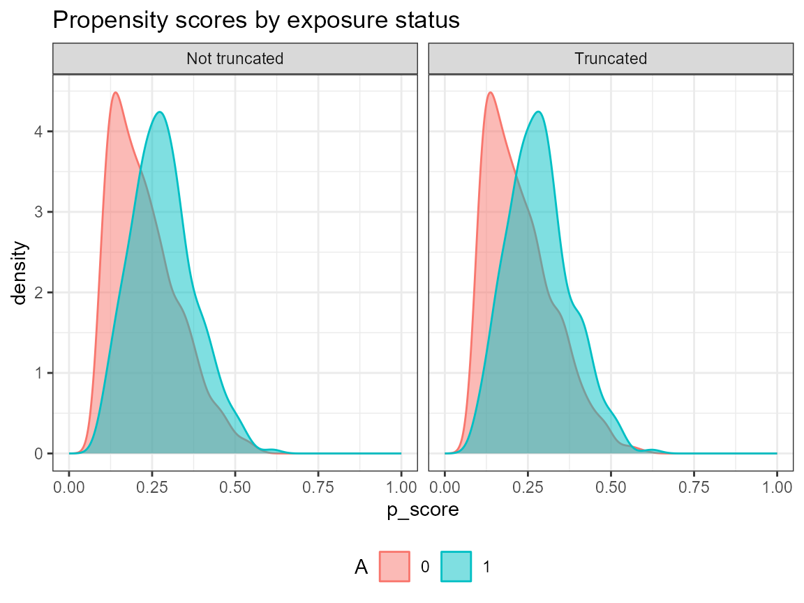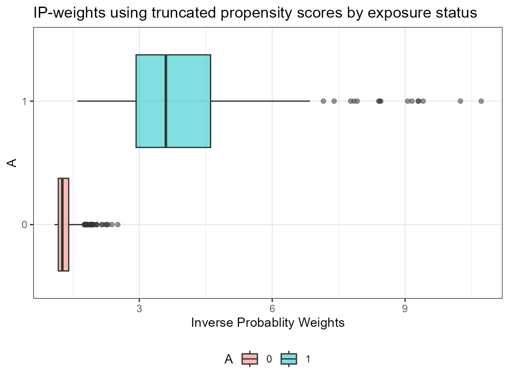

``` r


# Truncate weights (default truncation is set to 0.025)
AIPW_SL$fit()$summary(g.bound = c(0.05, 0.95))$plot.p_score()$plot.ip_weights()
## Done!
##                  Estimate     SE 95% LCL 95% UCL    N
## Mean of Exposure    19.24 0.1880   18.87   19.61  332
## Mean of Control     17.35 0.1759   17.01   17.70 1045
## Mean Difference      1.89 0.0705    1.75    2.03 1377
```

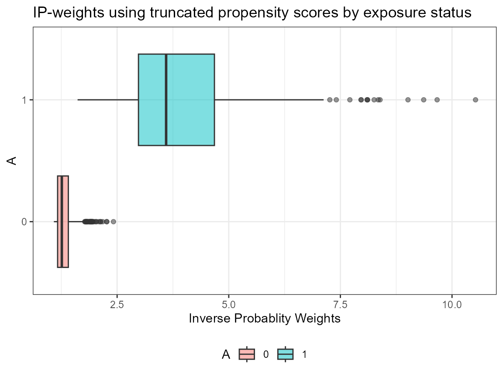

``` r


# Calculate average treatment effects among the treated/untreated (controls) (ATT/ATC)
AIPW_SL$stratified_fit()$summary()
## Done!
##                     Estimate     SE 95% LCL 95% UCL    N
## Mean of Exposure       19.30 0.1896   18.93   19.67  332
## Mean of Control        17.35 0.1760   17.01   17.70 1045
## Mean Difference         1.95 0.0712    1.81    2.09 1377
## ATT Mean Difference     1.76 0.0623    1.64    1.89 1377
## ATC Mean Difference     1.97 0.2249    1.53    2.41 1377


# extract weights for loveplots
# AIPW_SL$plot.ip_weights()
bcrot2$aipw <- AIPW_SL$ip_weights.plot$data$ip_weights

# loveplots + AIPW
cobalt::love.plot(hormon ~ age*enodes*pr_1 +
                           age.2*enodes*pr_1,
                  data = bcrot2,
                  weights = bcrot2$aipw,
                  s.d.denom = "pooled",
                  thresholds = c(m = .1))
```

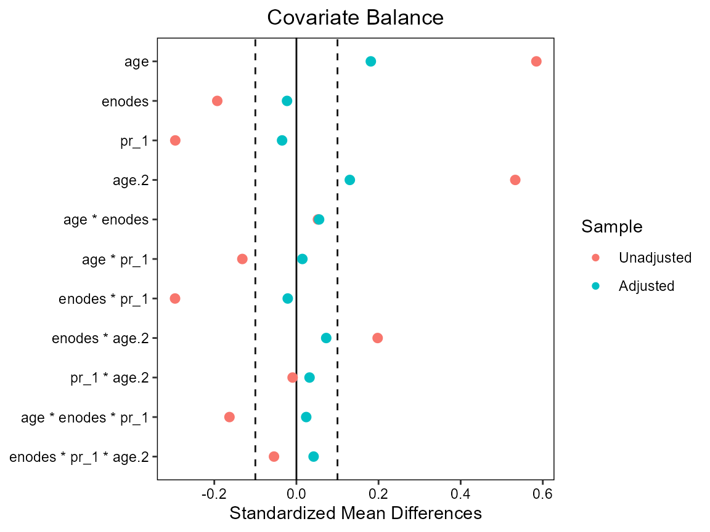

### Compare results in the restricted sample

This is a summary of all the different methods - of these we know that
regression standardization is correctly specified; we do not know this
for any of the other methods; but we know the true effect for our
synthetic QoL outcome. Note the much larger uncertainty for IPW.

``` r

out <- rbind(c(2.07, rep(NA,3)),
             c(coef(summary(lm.a2))[2,1:2], confint(lm.a2)[2,]),
             c(summary(model_sm2)$coefficients[2,1:2], confint(model_sm2)[2,]),
             summary(fit.std, contrast = "difference", reference = "0")$est.table[2,],
             raipw$estimates$RD)
dimnames(out) <- list(c("True ATE", "LM", "IPW", "RS", "AIPW"),
                      c("Estimate", "SE", "lower", "upper"))
print(round(out,3))
##          Estimate    SE lower upper
## True ATE    2.070    NA    NA    NA
## LM          1.807 0.065 1.679 1.935
## IPW         2.071 0.601 0.891 3.250
## RS          1.951 0.080 1.795 2.108
## AIPW        1.951 0.071 1.811 2.090
```
